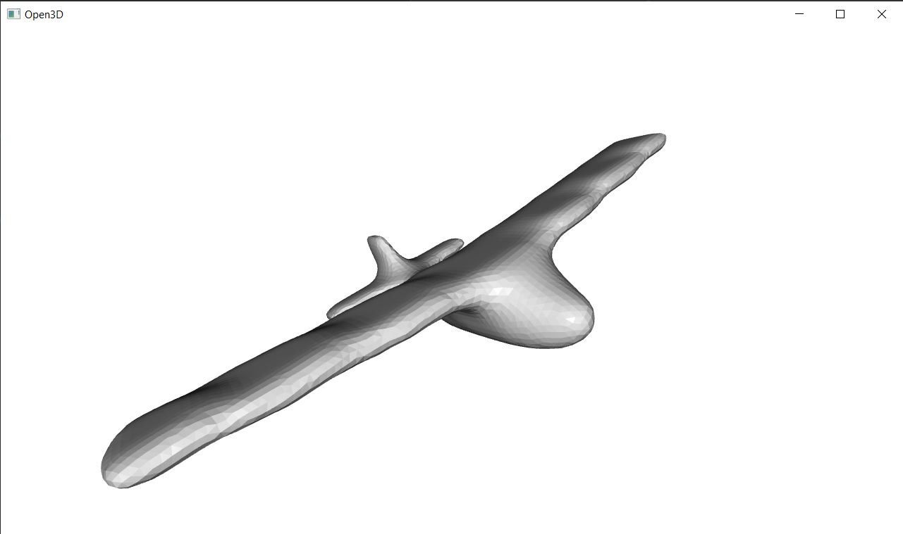
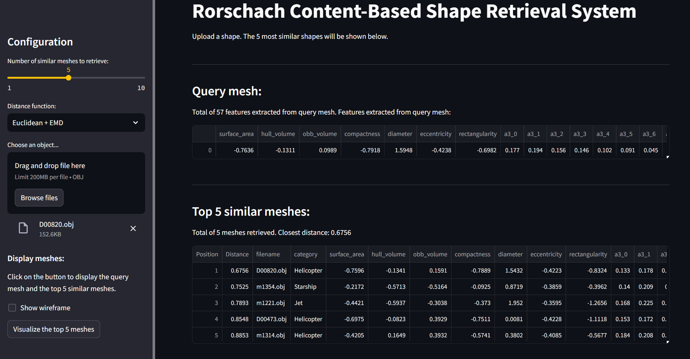

# INFOMR

Multimedia Retrieval

## Requirements

Please install [Python 3.8.10](https://www.python.org/downloads/release/python-3810/).

- Update pip: `python -m pip install --upgrade pip`
- Install packages for easier/faster/better installation of other packages: `pip install Cython wheel`
- Install required packages: `pip install -r requirements.txt`
- Check if installation was succesfull: `python -c "import open3d as o3d; print(o3d.__version__)"`

## Run the scripts

### Step 1: Read and view the data

To visualize the meshes, run `mesh_viewer.py`. Additional arguments can be provided:

```bash
python ./Rorschach/visualization/mesh_viewer.py --mesh_path ./data/AircraftBuoyant/m1337.obj --visualization_method shade
python ./Rorschach/visualization/mesh_viewer.py --mesh_path ./data_cleaned_/AircraftBuoyant/m1337.obj --visualization_method shade
python ./Rorschach/visualization/mesh_viewer.py --mesh_path ./data_normalized/AircraftBuoyant/m1337.obj --visualization_method shade

python ./Rorschach/visualization/mesh_viewer.py --mesh_path ./data/AircraftBuoyant/m1337.obj --visualization_method wired
python ./Rorschach/visualization/mesh_viewer.py --mesh_path ./data_cleaned_/AircraftBuoyant/m1337.obj --visualization_method wired
python ./Rorschach/visualization/mesh_viewer.py --mesh_path ./data_normalized/AircraftBuoyant/m1337.obj --visualization_method wired
```

After running any of the above commands, the resulting window should look similar to the following:



### Step 2: Preprocessing and cleaning

1. Run `python ./code/patch_meshes.py` to refine the meshes
2. Run `python ./code/preprocess.py` to normalize the meshes
3. Run `python ./code/visualize_data.py` to generate statistics for the refined and normalised meshes

## Screenshots



## Resources

- [The assignment](https://webspace.science.uu.nl/~telea001/MR/Assignment)
- [Open3D - Getting started](open3d.org/docs/release/getting_started.html)
- [Princeton Shape Benchmark dataset](https://shape.cs.princeton.edu/benchmark/)
- [Labeled PSB dataset](https://people.cs.umass.edu/~kalo/papers/LabelMeshes/)
  - [Download link](https://people.cs.umass.edu/~kalo/papers/LabelMeshes/labeledDb.7z)
- [ShapeDatabase provided by TA's for testing](https://github.com/MaxRee94/ShapeDatabase_INFOMR)
